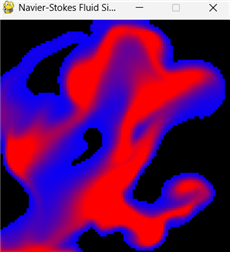
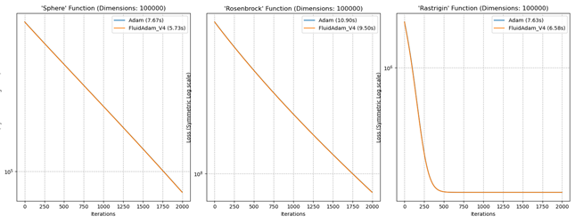
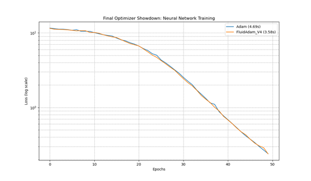
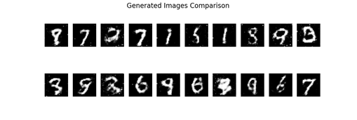

# <p align="center">🌊 FluidAdam</p>
<p align="center"><b>Navier-Stokes Equation Based Optimizer for Deep Learning</b></p>

<p align="center">
  
  
  
  
</p>

---

## 🌟 Overview

> **"Can we navigate the Loss Landscape like water flowing down a valley?"**

**FluidAdam** is a novel deep learning optimizer inspired by the **Navier-Stokes equations** of fluid dynamics. Unlike traditional momentum-based optimizers (like Adam) that behave like a ball rolling down a hill, FluidAdam mimics the behavior of a fluid, utilizing concepts of **viscosity ($\nu$)** and **acceleration** to escape local minima and converge stably.

---

## 💡 Key Concept

Traditional gradient descent methods often struggle with local minima. I hypothesized that treating the optimization process as a **fluid simulation** could offer a solution.

### Fluid Dynamics Visualization
Actual visualization of the Navier-Stokes equations implemented in this project (`simulation.py`).


Based on the simplified Navier-Stokes equation:
$$ \mathbf{v}_{t+1} = \mathbf{v}_t + \text{Acceleration} - \nu \cdot (\text{Viscosity}) $$

In **FluidAdam (V4)**, this is translated to:
1.  **Fluid Gradient:** Calculates the *change* in gradient (acceleration).
2.  **Viscosity ($\nu$):** A hyperparameter that stabilizes the flow.

---

## 📊 Performance & Results

### 1. Mathematical Benchmark Functions
Tested on non-convex functions (Sphere, Rosenbrock, Rastrigin). **FluidAdam V4 (Orange)** converges significantly faster than **Adam (Blue)**, especially in complex landscapes.



### 2. Neural Network Training
Comparison of loss reduction speed in a standard Neural Network regression task. FluidAdam reaches the target loss with fewer epochs.



### 3. GAN Training (MNIST)
Generative Adversarial Networks (GANs) are notoriously unstable. FluidAdam demonstrated stable convergence and generated clear digit images.




## 🛠️ Getting Started

### Installation

```bash
# Clone the repository
git clone https://github.com/lenftk/FluidAdam-Optimizer.git
cd FluidAdam-Optimizer

# Install dependencies
pip install -r requirements.txt
```

### Usage Example

```python
import torch
from fluid_adam import FluidAdam

# 1. Define your model and data
model = MyNeuralNet()
criterion = torch.nn.CrossEntropyLoss()

# 2. Initialize FluidAdam (Recommended nu=0.7)
optimizer = FluidAdam(model.parameters(), lr=1e-3, nu=0.7)

# 3. Training Loop
for epoch in range(10):
    optimizer.zero_grad()
    output = model(input)
    loss = criterion(output, target)
    loss.backward()
    optimizer.step()
```

---

## 📂 Project Structure

```text
FluidAdam-Optimizer/
├── fluid_adam.py          # [Core] FluidAdam (V4) Implementation
├── simulation.py          # [Visual] 2D NS Fluid Simulation (PoC)
├── experiments/
│   ├── benchmark_func.py  # Math function benchmarks
│   └── benchmark_gan.py   # GAN training experiments
├── assets/                # Visual assets and plots
├── requirements.txt       # Project dependencies
└── LICENSE                # MIT License
```

---

## 🧑‍💻 Author

**JuHo Min**
- 📧 [juhomin16@gmail.com](mailto:juhomin16@gmail.com)
- 🎓 *Note: Developed as pre-university research for admission. Currently an incoming freshman (Class of '26).*

---

## 📜 License

This project is licensed under the **MIT License**. See the [LICENSE](LICENSE) file for details.
